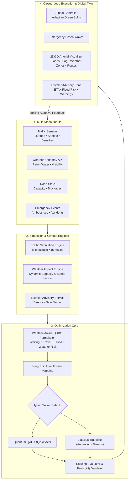

<p align="center">
  
</p>

<h1 align="center">SNS Quantum Traffic Optimization</h1>
<h3 align="center">A Hybrid Quantum-Classical, Weather-Aware Adaptive Urban Traffic Management and Route Optimization System</h3>
<p align="center">
  <em>Adaptive Signals • Weather Intelligence • Flood & Fog Awareness • Quantum QUBO/QAOA Optimization • Traveler Guidance</em>
</p>

<p align="center">
  
  
  
  
  
  
  
</p>

---

## 📑 Table of Contents
1. [Project Vision & Overview](#1-project-vision--overview)
2. [Core Problem & The Need for Adaptive Traffic Management](#2-core-problem--the-need-for-adaptive-traffic-management)
3. [System Architecture & Data Flow](#3-system-architecture--data-flow)
4. [Intersection Network (4–8 Connected Intersections)](#4-intersection-network-48-connected-intersections)
5. [Microscopic Traffic Simulation Engine](#5-microscopic-traffic-simulation-engine)
6. [Weather Engine & Multi-Zone Climate Model](#6-weather-engine--multi-zone-climate-model)
7. [Weather Impact Engine & Road Degradation Dynamics](#7-weather-impact-engine--road-degradation-dynamics)
8. [Flood / Water-Flow & Fog / Mist Disruption Mechanisms](#8-flood--water-flow--fog--mist-disruption-mechanisms)
9. [Mathematical Formulation: Weather-Aware QUBO & Ising Mapping](#9-mathematical-formulation-weather-aware-qubo--ising-mapping)
10. [Quantum Optimization: QAOA on Qiskit Aer](#10-quantum-optimization-qaoa-on-qiskit-aer)
11. [Classical Baseline Solvers & Comparative Benchmarks](#11-classical-baseline-solvers--comparative-benchmarks)
12. [Traveler Route Optimization & Weather Advisory Guidance](#12-traveler-route-optimization--weather-advisory-guidance)
13. [Emergency Vehicle Priority & Green Wave Corridors](#13-emergency-vehicle-priority--green-wave-corridors)
14. [Adaptive Rolling Re-Optimization Loop](#14-adaptive-rolling-re-optimization-loop)
15. [Master Demonstration Scenarios (1 to 6)](#15-master-demonstration-scenarios-1-to-6)
16. [Interactive Digital Twin & 2D/3D Network Visualizer](#16-interactive-digital-twin--2d3d-network-visualizer)
17. [REST API Endpoints & WebSocket Telemetry](#17-rest-api-endpoints--websocket-telemetry)
18. [Project Structure](#18-project-structure)
19. [Installation & Execution Guide](#19-installation--execution-guide)
20. [Testing & Quality Verification](#20-testing--quality-verification)
21. [Scientific Honesty & Quantum Modeling Disclosures](#21-scientific-honesty--quantum-modeling-disclosures)

---

## 1. Project Vision & Overview

**SNS Quantum Traffic Optimization** is a comprehensive, production-grade prototype platform that simulates an interconnected urban arterial network and dynamically optimizes traffic signal timings and traveler routes in response to:

* Real-time traffic density, queue lengths, and arterial saturation
* Road capacity variations and dynamic lane availability
* Multi-zone weather conditions (clear, heavy rain, flooding/water flow, fog/mist)
* Water accumulation, flow directions, and lane blockages
* Accidents, lane closures, and sudden congestion spikes
* Priority dispatch for emergency response vehicles (ambulances, fire engines, police)
* Divergent alternative route availability for municipal travelers

The system proves that changing environmental and meteorological conditions dynamically shift traffic physics and demand patterns, necessitating real-time re-formulation of Quadratic Unconstrained Binary Optimization (QUBO) problem matrices solved via hybrid quantum-classical algorithms.

---

## 2. Core Problem & The Need for Adaptive Traffic Management

Conventional municipal traffic signals operate on pre-timed daily schedules or isolated actuated sensors. They fail to adapt when adverse weather degrades roadway capacity:

| Environmental State | Observed Phenomena | Systemic Impact |
|---|---|---|
| **Normal Condition (Zone 1 / 4)** | Clear skies, dry pavement, normal road friction, 100% capacity | Smooth progression; standard green splits are optimal. |
| **Heavy Rain / Flood (Zone 2)** | Downpours, standing water, sheet water flow across pavement, 1+ unusable lanes | Road capacity drops to 40–70%, vehicle speeds drop by 25–60%, severe queue spillbacks develop. |
| **Fog / Mist (Zone 3)** | Early morning/night mist, visibility $< 1.0\text{ km}$, increased safe following distance | Speeds drop by 50%, reaction times double, elevated disruption/risk parameter. |

**SNS Quantum Traffic Optimization** recognizes these environmental variations across micro-climates in real time, re-allocates green durations to clear backed-up approaches, and guides travelers away from flooded bottlenecks toward safe, dry detour corridors.

---

## 3. System Architecture & Data Flow



---

## 4. Intersection Network (4–8 Connected Intersections)

The platform models a configurable metropolitan arterial grid featuring **6 interconnected signalized junctions** ($I_1$ through $I_6$) partitioned into **4 Weather Zones**:

```text
       [Zone 1: Clear]                     [Zone 2: Flood / Heavy Rain]              [Zone 3: Fog / Mist]
   +-----------------------+              +-----------------------------+          +-----------------------+
   | (I1) West Gateway     |====[RT 10]==>| (I2) Grand Central          |==[RT 10]=>| (I3) Financial Plaza  |
   +-----------------------+              +-----------------------------+          +-----------------------+
              ||                                         ||                                   ||
       [1st Ave North]                            [Broadway Ave]                           [I-95]
              ||                                         ||                                   ||
   +-----------------------+              +-----------------------------+          +-----------------------+
   | (I4) South Civic Hub  |====[RT 20]==>| (I5) Market Square          |==[RT 20]=>| (I6) Tech Innovation  |
   +-----------------------+              +-----------------------------+          +-----------------------+
       [Zone 4: Clear]                     [Zone 2: Flood / Heavy Rain]              [Zone 3: Fog / Mist]
```

Each intersection features:
* **Intersection ID** & human municipal street name
* Connected arterial approaches and opposing directional lanes
* Dual-ring signal phases (`EW_GREEN` and `NS_GREEN`) with clearance intervals
* Real-time vehicle counts, queue depths, and queue spillback warnings
* Assigned Weather Zone with dynamic capacity and risk multipliers

---

## 5. Microscopic Traffic Simulation Engine

Vehicular movement is computed through discrete-time microscopic kinematics:

$$\begin{aligned}
v(t + \Delta t) &= \min\left(v_{\text{target}} \cdot \mu_{\text{speed}}, \; v(t) + a_{\text{accel}} \Delta t\right) \\
x(t + \Delta t) &= x(t) + v(t + \Delta t) \Delta t
\end{aligned}$$

Key features:
* **Car-Following & Deceleration**: Safe stopping distances before red signals and preceding vehicles.
* **Lane Selection & Saturation**: Vehicles advance only when the downstream link has available capacity under weather-degraded limits.
* **Vehicle Types**: Normal passenger vehicles and priority emergency responders (ambulances with activated siren beacons).
* **Fuel & Emissions**: Idling fuel burn ($0.08\text{ L/hr}$) and moving consumption ($2.4\text{ L/hr}$) converted to $\text{CO}_2$ emissions ($2.31\text{ kg CO}_2\text{/L}$).

---

## 6. Weather Engine & Multi-Zone Climate Model

The urban network is divided into 4 autonomous meteorological zones:

| Zone ID | Name | Default Condition | Assigned Intersections | Assigned Arterials |
|---|---|---|---|---|
| `zone-1` | Northwest Transit Gateway | `CLEAR` | $I_1$ | `E_I1_I2`, `E_I1_I4` |
| `zone-2` | Central Grand Corridor | `HEAVY_RAIN` / `FLOODING` | $I_2$, $I_5$ | `E_I1_I2`, `E_I2_I5`, `E_I2_I3`, `E_I4_I5`, `E_I5_I6` |
| `zone-3` | East Innovation District | `FOG` / `MIST` | $I_3$, $I_6$ | `E_I2_I3`, `E_I3_I6`, `E_I5_I6` |
| `zone-4` | South Health & Civic Plaza | `CLEAR` | $I_4$ | `E_I1_I4`, `E_I4_I5` |

Conditions supported: `CLEAR`, `CLOUDY`, `LIGHT_RAIN`, `HEAVY_RAIN`, `FLOODING`, `FOG`, `MIST`, `STORM`.

---

## 7. Weather Impact Engine & Road Degradation Dynamics

Weather conditions do not merely appear visually; they modulate microscopic roadway parameters:

| Weather Condition | Capacity Factor ($\mu_{\text{cap}}$) | Speed Factor ($\mu_{\text{spd}}$) | Lane Availability | Visibility | Risk Factor |
|---|---|---|---|---|---|
| **Clear** | $1.00$ | $1.00$ | $100\%$ | $10.0\text{ km}$ | $0.00$ |
| **Light Rain** | $0.85$ | $0.88$ | $100\%$ | $6.0\text{ km}$ | $0.20$ |
| **Heavy Rain** | $0.70$ | $0.75$ | $100\%$ | $3.5\text{ km}$ | $0.50$ |
| **Flooding** | $0.40$ | $0.40$ | $50\%$ (1 Lane Blocked) | $2.0\text{ km}$ | $0.90$ |
| **Fog / Mist** | $0.65$ | $0.50$ | $100\%$ | $0.8\text{ km}$ | $0.70$ |
| **Storm** | $0.35$ | $0.35$ | $50\%$ | $1.0\text{ km}$ | $0.95$ |

*All parameters are fully configurable through the REST API and labeled as simulation parameters.*

---

## 8. Flood / Water-Flow & Fog / Mist Disruption Mechanisms

### Flood / Water-Flow Mechanism
$$\text{Heavy Rain} \;\longrightarrow\; \text{Water Accumulation} \;\longrightarrow\; \text{Cross-Road Water Flow} \;\longrightarrow\; \text{Lane Blockage} \;\longrightarrow\; \text{Capacity Dips to } 40\% \;\longrightarrow\; \text{Spillback Queue}$$

* **Visual Representation**: Water ripple stripes over affected pavement, directional water-flow indicators, and `⚠️ 1 LANE BLOCKED (FLOOD)` warning badges.
* **Physics Impact**: Vehicles in the blocked lane merge, speeds drop to $40\%$, and effective vehicle capacity is halved.

### Fog / Mist Mechanism
$$\text{Fog / Mist} \;\longrightarrow\; \text{Visibility Drops to } < 1\text{ km} \;\longrightarrow\; \text{Target Speed Damped by } 50\% \;\longrightarrow\; \text{Reaction Distance Increases} \;\longrightarrow\; \text{Elevated Risk Score}$$

* **Visual Representation**: Translucent fog mist layer across Zone 3 and a visibility indicator.
* **Physics Impact**: Car-following headway increases to model defensive driving under low visibility.

---

## 9. Mathematical Formulation: Weather-Aware QUBO & Ising Mapping

### 9.1 Multi-Objective Function
The global cost function balances waiting time, link throughput, congestion, emergency delay, and weather/flood risk exposure:

$$\min \mathcal{J} = \alpha \sum_{i} \text{Wait}_i + \beta \sum_{e} \text{Travel}_e + \gamma \sum_{e} \text{Congestion}_e + \delta \sum_{e} \text{WeatherRisk}_e + \epsilon \sum_{e} \text{FloodRisk}_e - \zeta \cdot \text{EmergencyBonus}$$

### 9.2 Binary Encoding
Let binary variables $x_{i, p} \in \{0, 1\}$ indicate whether phase $p \in \{\text{EW}, \text{NS}\}$ is active at intersection $i$.

The Quadratic Unconstrained Binary Optimization (QUBO) problem takes the standard matrix form:

$$\min_{x \in \{0, 1\}^N} x^T Q x + c$$

* **Linear Diagonal Coefficients ($Q_{ii}$)**: Quantify the queue relief minus the adverse weather risk of routing vehicles into degraded downstream links.
* **Quadratic Coupling Coefficients ($Q_{ij}$)**: Incentivize green progression waves between adjacent signals along shared corridors.
* **One-Hot Validity Constraint**: Guarantees exactly one active phase per junction via penalty multiplier $P$:

$$P_{\text{one-hot}} = P \sum_{i} \left( \sum_{p} x_{i, p} - 1 \right)^2$$

### 9.3 Ising Spin Hamiltonian Mapping
To execute on quantum simulators, binary variables are transformed to Pauli-$Z$ spin operators via:

$$x_i = \frac{I - Z_i}{2}$$

Yielding the Ising Problem Hamiltonian $H_C$:

$$H_C = \sum_{i} h_i Z_i + \sum_{i < j} J_{ij} Z_i Z_j + c_{\text{Ising}} I$$

Where local fields $h_i$ and two-qubit couplings $J_{ij}$ are derived analytically:

$$h_i = -\frac{Q_{ii}}{2} - \sum_{j \neq i} \frac{Q_{ij}}{4}, \qquad J_{ij} = \frac{Q_{ij}}{4}$$

---

## 10. Quantum Optimization: QAOA on Qiskit Aer

The Quantum Approximate Optimization Algorithm (QAOA) prepares a parameterized $p$-layer quantum state:

$$|\psi(\boldsymbol{\gamma}, \boldsymbol{\beta})\rangle = \prod_{l=1}^p \left( e^{-i \beta_l H_M} e^{-i \gamma_l H_C} \right) |+\rangle^{\otimes N}$$

1. **Initial Superposition**: All qubits initialized to $|+\rangle^{\otimes N} = H^{\otimes N}|0\rangle^{\otimes N}$.
2. **Phase Separator $e^{-i \gamma_l H_C}$**: Implemented using single-qubit $R_Z$ rotations and two-qubit $R_{ZZ}$ entangling gates.
3. **Mixer Hamiltonian $H_M = \sum_i X_i$**: Implemented via $R_X(2\beta_l)$ rotations.
4. **Classical Optimization Loop**: Expectation value $\langle \psi | H_C | \psi \rangle$ is minimized using the classical **COBYLA** optimizer on **Qiskit Aer** (`AerSimulator`), sampling ground-state bitstrings.
5. **Constraint Validation**: Every measured candidate bitstring is strictly validated for feasibility (exactly one active phase per intersection). Invalid configurations are filtered or repaired before application to signals.

---

## 11. Classical Baseline Solvers & Comparative Benchmarks

The system incorporates classical baseline algorithms to measure empirical performance against QAOA:

* **Simulated Annealing Baseline**: Explores the same QUBO energy landscape through thermal Metropolis-Hastings state transitions.
* **Greedy Heuristic Baseline**: Assigns green lights to the highest instantaneous queue approach.
* **Fixed-Time Baseline**: Traditional pre-timed round-robin cycle splits.

Performance metrics recorded:
* Objective function value (energy)
* Feasible solution rate ($100\%$)
* Execution runtime (milliseconds)
* Total waiting time and vehicular throughput

---

## 12. Traveler Route Optimization & Weather Advisory Guidance

The **Traveler Weather Advisory Service** compares the direct arterial route against a flood-safe detour corridor:

```text
Traveler Request: Origin = I1 (West Gateway) ➔ Destination = I6 (Tech District)

DIRECT ROUTE (Via Grand Central I2):
  * Path: I1 ➔ I2 ➔ I5 ➔ I6
  * Weather: Heavy Rain + Flooding in Zone 2
  * Warning: ⚠️ 1 Lane Blocked by Water Accumulation (12 cm)
  * Travel Time: 14.2 min (High Congestion)

ALTERNATIVE DETOUR ROUTE (Via South Civic I4):
  * Path: I1 ➔ I4 ➔ I5 ➔ I6
  * Weather: Dry Pavement / Normal Flow in Zone 4 & 1
  * Warning: None (Safe Corridor)
  * Travel Time: 8.5 min (Lower Congestion)
  * Advantage: 40% Time Saved • 100% Flood Risk Avoided

[SELECT & HIGHLIGHT SAFE ROUTE ON 2D MAP]
```

*The traveler is presented with full data and warnings rather than forced onto a path automatically.*

---

## 13. Emergency Vehicle Priority & Green Wave Corridors

When an ambulance, fire truck, or police vehicle enters the network:
1. **Route Calculation**: Determines the optimal path to hospital/destination avoiding flooded roads where possible.
2. **Preemptive Signal Preemption**: Estimates arrival times (ETA) at downstream signals and reserves a synchronized green corridor (`PRIORITY GREEN`).
3. **Queue Dissipation**: Safely discharges cross-traffic queues accumulated during the emergency window after the vehicle passes.

---

## 14. Adaptive Rolling Re-Optimization Loop

The system operates in a closed continuous loop:

$$\begin{aligned}
T_0 &\longrightarrow \text{Sense Traffic Queues + Weather Zone States} \\
    &\longrightarrow \text{Construct Weather-Aware QUBO Matrix} \\
    &\longrightarrow \text{Execute QAOA Simulation on Qiskit Aer} \\
    &\longrightarrow \text{Validate & Apply Optimal Green Splits} \\
    &\longrightarrow \text{Vehicles Advance in Simulation Engine} \\
T_1 &\longrightarrow \text{Weather Changes (e.g. Rain to Flood) / Queues Shift} \\
    &\longrightarrow \text{Re-Formulate QUBO & Re-Optimize}
\end{aligned}$$

---

## 15. Master Demonstration Scenarios (1 to 6)

The platform provides 6 reproducible, jury-ready demonstration scenarios:

| # | Scenario Name | Meteorological Setup | Key Demonstration Focus |
|---|---|---|---|
| **1** | **Normal Traffic** | All zones `CLEAR` | Baseline green split coordination; classical vs QAOA comparison. |
| **2** | **Heavy Rain** | Zone 2 `HEAVY_RAIN` | Rain intensity 45 mm/h; speed damping $25\%$; throughput comparison. |
| **3** | **Flooding** | Zone 2 `FLOODING` | Water level 15 cm; 1 lane blocked; queue surge; QUBO changes. |
| **4** | **Fog / Mist** | Zone 3 `FOG` | Visibility $< 1\text{ km}$; speed factor $0.50$; risk penalty activation. |
| **5** | **Mixed Weather** | Z1 Clear, Z2 Flood, Z3 Fog, Z4 Clear | Multi-zone differential physics and cross-network optimization. |
| **6** | **Emergency + Flood** | Zone 2 Flooded + Active Ambulance | Emergency vehicle rerouting and green wave corridor synchronization through adverse conditions. |

---

## 16. Interactive Digital Twin & 2D/3D Network Visualizer

The Next.js operations console features an interactive digital twin canvas:
* **Zone Overlays**: Color-coded boundary boxes with real-time status plaques for all 4 zones.
* **Flood & Fog Animation**: Water ripple currents over flooded pavement and soft atmospheric mist over foggy sectors.
* **Vehicle Rendering**: Moving passenger cars and high-visibility emergency ambulances with flashing beacons and headlight beams.
* **Signal Heads**: 4-way LED optic signals cycling between Green, Yellow, and Red.
* **Route Highlighting**: Real-time rendering of traveler advisory routes (amber dashed for flooded direct route, glowing emerald for safe detour).

---

## 17. REST API Endpoints & WebSocket Telemetry

### Weather & Advisory APIs
* `GET  /api/v1/weather/zones` — Retrieve all zone states, road factors, and climate conditions.
* `POST /api/v1/weather/zones/{id}` — Dynamically modify zone weather (e.g. `clear` to `flooding`).
* `POST /api/v1/routes/traveler-advisory` — Compute direct vs alternative route comparison with flood warnings.

### Simulation & Signal Control APIs
* `POST /api/v1/simulation/create` — Initialize network session with selected master scenario.
* `POST /api/v1/simulation/start` — Start continuous simulation.
* `POST /api/v1/simulation/step` — Advance simulation by $N$ seconds.
* `POST /api/v1/simulation/pause` — Pause simulation.
* `POST /api/v1/optimization/optimize` — Trigger on-demand QAOA optimization.
* `POST /api/v1/emergency/corridors` — Dispatch emergency vehicle with green wave preemption.
* `WS   /ws/simulation` — Full 60 FPS real-time telemetry stream.

---

## 18. Project Structure

```text
Quantum-Traffic-Priority-Routing/
├── backend/
│   ├── app/
│   │   ├── adaptive/         # Dynamic cycle control and adaptive rules
│   │   ├── api/              # FastAPI REST routers & WebSocket streamer
│   │   ├── benchmark/        # Classical baseline runners (Annealing, Greedy, Fixed)
│   │   ├── core/             # Pydantic configuration and platform constants
│   │   ├── domain/           # Network graph, weather models, signals, and vehicles
│   │   ├── emergency/        # Emergency vehicle dispatcher and green wave coordinator
│   │   ├── events/           # Dynamic incident injection engine
│   │   ├── metrics/          # Delay, throughput, fuel burn, and CO2 models
│   │   ├── optimization/     # Hybrid quantum-classical solver pipeline
│   │   ├── quantum/          # Qiskit Aer QAOA, Ising converter, and ansatz circuits
│   │   ├── routing/          # Traveler Weather Advisory Service & route evaluator
│   │   ├── signals/qubo/     # Weather-aware QUBO matrix builder & decoders
│   │   ├── simulation/       # Microscopic kinematics engine & 6 master scenarios
│   │   └── weather/          # WeatherEngine singleton and climate zone manager
│   └── tests/
│       ├── unit/             # 38 unit test modules (100% passing)
│       └── integration/      # End-to-end simulation lifecycle & API tests
├── frontend/
│   ├── app/
│   │   ├── layout.tsx        # Root layout with ThemeProvider & branding
│   │   ├── page.tsx          # Standalone Landing / Hero Page
│   │   ├── console/page.tsx  # Full Operations Console with all panels
│   │   └── globals.css       # Obsidian Cyberpunk Design System
│   ├── components/
│   │   ├── dashboard/        # Header, ControlPanel, Sidebar
│   │   ├── emergency/        # EmergencyCorridorPanel
│   │   ├── events/           # EventInjectionModal, EventTimeline
│   │   ├── metrics/          # MetricCards, MetricTrends
│   │   ├── quantum/          # QuantumPanel, ClassicalComparison
│   │   ├── routes/           # TravelerAdvisoryPanel (Direct vs Detour)
│   │   ├── traffic/          # TrafficMap (Weather overlays, floods, routes)
│   │   ├── weather/          # WeatherControlPanel (Live zone switcher)
│   │   └── ui/               # LatticeLoader (LED matrix pulse animation)
│   └── public/               # Logos, emblems, and visual assets
├── docs/                     # Technical specifications and architecture specs
└── README.md                 # Master project documentation
```

---

## 19. Installation & Execution Guide

### 19.1 Prerequisites
* **Operating System**: Windows 10/11, macOS, or Linux
* **Python**: `3.11` or `3.12`
* **Node.js**: `20.x` LTS or higher
* **npm**: `10.x` or higher

### 19.2 Step-by-Step Setup

#### 1. Clone the Repository
```bash
git clone https://github.com/karteyareddy/Qubits-Quantexa_Project.git
cd Qubits-Quantexa_Project
```

#### 2. Configure Python Virtual Environment
* **Windows (PowerShell)**:
  ```powershell
  python -m venv .venv
  .venv\Scripts\activate
  ```
* **macOS / Linux**:
  ```bash
  python3 -m venv .venv
  source .venv/bin/activate
  ```

#### 3. Install Python Dependencies
```bash
pip install --upgrade pip
pip install -r requirements.txt
```

#### 4. Install Frontend Dependencies
```bash
cd frontend
npm install
cd ..
```

---

### 19.3 Launching the Application

Run the backend and frontend in two separate terminal windows:

#### Terminal 1: Backend API Server (FastAPI on Port 8000)
```bash
# Ensure virtual environment is active (.venv)
python -m uvicorn app.api.main:app --app-dir backend --reload --host 127.0.0.1 --port 8000
```
* API Server: `http://127.0.0.1:8000`
* Interactive API Documentation: `http://127.0.0.1:8000/docs`

#### Terminal 2: Frontend Operations Center (Next.js on Port 3000)
```bash
cd frontend
npm run dev
```
* Operations Console: `http://localhost:3000/console`
* Landing Page: `http://localhost:3000`

---

## 20. Testing & Quality Verification

Run the full verification suite to confirm all subsystems pass:

```bash
# 1. Run full backend unit and integration test suite (181 tests)
python -m pytest backend/tests -q

# 2. Run unit tests only
python -m pytest backend/tests/unit -q

# 3. Run integration tests only
python -m pytest backend/tests/integration -q

# 4. Verify Next.js frontend TypeScript compilation and build
cd frontend
npm run build
```

---

## 21. Scientific Honesty & Quantum Modeling Disclosures

In strict alignment with scientific integrity and transparent engineering standards:
* **Quantum Simulation**: All QAOA circuit executions run on the **Qiskit Aer** statevector simulator (`AerSimulator`). They model exact quantum state evolution, parameterized unitaries, and projective measurements, but execute on classical host hardware. No claim of physical quantum advantage is made.
* **Deterministic Fallback**: The system features an explicit classical fallback mode (simulated annealing / heuristic optimizer) when problem dimensions exceed the simulator capacity or time bounds.
* **Traffic Disruption vs. Hydrology**: The flood/water-flow model is a calibrated traffic-disruption simulation that adjusts effective capacity, speeds, and available lanes; it is not a hydrological forecasting model.
* **Configurable Simulation Parameters**: All climate impact coefficients are modular simulation parameters ready for calibration against real-world municipal sensor data.
