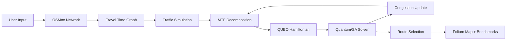

# 🚦 Quantum Traffic Priority Routing

<div align="center">

**Priority-Aware Quantum Traffic Optimization: Integrating Emergency Corridors into the MTF Framework**

[](https://www.python.org/)
[](https://streamlit.io/)
[](https://www.dwavesys.com/)
[](https://osmnx.readthedocs.io/)
[](LICENSE)

*Priority-Aware Mini-scale Traffic Flow optimization with dynamic emergency green corridors*

</div>

---

## 🎯 Abstract

Urban traffic congestion poses a critical challenge not only to daily commuters but, more severely, to emergency response systems where delay can be a matter of life and death. Traditional traffic optimization models, including recent quantum-inspired approaches like the Mini-scale Traffic Flow (MTF) method, typically minimize global network congestion by treating all vehicles as equal entities. This "equity-based" approach often fails to account for the critical urgency required by emergency service vehicles (ESVs).

This project presents a **modified Priority-Aware MTF algorithm** that integrates a weighted prioritization layer into the standard **Quadratic Unconstrained Binary Optimization (QUBO)** formulation. By assigning distinct, high-value weight coefficients to ESVs within the Cost Hamiltonian, the proposed system dynamically clears **"green corridors"** for priority vehicles while optimizing the remaining traffic flow around them. We utilize the **iterative decomposition method of MTF** to solve these weighted sub-problems on a **D-Wave Quantum Processing Unit (QPU)**. The system is evaluated using a simulated urban environment with mixed traffic, demonstrating that the Priority-Aware MTF can significantly reduce ESV travel time compared to standard quantum optimization, with only a marginal increase in aggregate network latency.

---

## ❗ Problem Statement

### The Challenge

**Urban traffic congestion delays emergency response vehicles, costing lives.**

- 🚑 Ambulances stuck in traffic can increase response time by 40-60%  
- 🚒 Fire trucks lose critical minutes navigating congested roads
- 🚓 Police vehicles face similar challenges reaching emergency scenes

### Current Solutions Fall Short

Most traffic optimization systems:
- ❌ Treat all vehicles equally (no priority awareness)
- ❌ Use simple shortest-path algorithms (ignore real-time congestion)
- ❌ Cannot dynamically create emergency corridors
- ❌ Don't consider multiple conflicting routes simultaneously

### Our Solution

This project introduces a **Priority-Aware MTF (Mini-scale Traffic Flow)** system that:
- ✅ Integrates a **weighted prioritization layer** into the QUBO Cost Hamiltonian
- ✅ Uses **iterative decomposition** to solve sub-problems on quantum hardware
- ✅ Creates dynamic **green corridors** by penalizing regular vehicles on ESV routes
- ✅ Supports **6 solver backends** including direct D-Wave QPU access
- ✅ Provides **benchmarking** to validate ESV travel time reduction

---

## ✨ Key Features

### ⚛️ Priority-Aware MTF Algorithm
- **Three-term Cost Hamiltonian**: `H = α·H_route + β·H_congestion + γ·H_constraint`
- **Emergency Boost**: ESVs receive 10× weight in congestion penalty, creating green corridors
- **Iterative Decomposition**: Vehicles split into sub-problems (ESVs first), solved sequentially
- **Congestion Feedback**: Edge congestion updated after each sub-problem for realistic flow

### 🖥️ Six Solver Backends

| Method | Type | Best For |
|--------|------|----------|
| `neal` | D-Wave Neal SA | **Default** — quantum-inspired, most realistic |
| `sa` | dimod basic SA | Lightweight fallback |
| `tabu` | D-Wave Tabu Search | Alternative for benchmarks |
| `exact` | Brute-force | Tiny problems (<20 vars), guarantees optimum |
| `qpu` | `EmbeddingComposite(DWaveSampler())` | **Direct QPU** — ideal for small MTF sub-problems |
| `dwave` | `LeapHybridSampler` | Large problems (100+ vars) |

> Every cloud solver gracefully falls back to Neal SA if unavailable — the app **never crashes**.

### 🗺️ Real-World Integration
- **OpenStreetMap**: Uses actual road networks from any city via OSMnx
- **Travel Time Computation**: `travel_time = (length / speed) × congestion_factor` on every edge
- **k-Shortest Paths**: Candidate routes generated using Yen's algorithm
- **Graph Caching**: Pickle-based caching for fast repeated loads

### 📊 Benchmarking & Evaluation
- **Standard vs Priority-Aware**: Side-by-side comparison on the same traffic scenario
- **Key Metrics**: ESV travel time reduction %, aggregate latency change %
- **Bar Charts**: Visual comparison of ESV, regular, and aggregate travel times
- **Energy Convergence**: Per-iteration QUBO energy plotted across MTF iterations
- **Detailed Energy Data**: Per-subproblem energy breakdown with emergency/regular tags

### 🎛️ Interactive Streamlit Dashboard
- **Tabbed Interface**: 🗺️ Traffic Map | 📊 Benchmarking & Evaluation
- **Address Input**: Type "From" and "To" — auto-geocoded and snapped to road network
- **Time-of-Day Presets**: Morning, Evening, etc. control vehicle count and emergency ratio
- **One-Click Optimize**: Runs the full MTF pipeline and shows original vs optimized route

---

## 🏗️ Technical Architecture

### System Workflow



### Priority-Aware Cost Hamiltonian

The system formulates traffic routing as a **Quadratic Unconstrained Binary Optimization** problem with three terms:

```
H_cost = α · H_route_cost + β · H_congestion + γ · H_one_route_constraint

H_route_cost:
  For each vehicle v, route r:
    weight = α × priority_weight   (if emergency)
    weight = α                      (if regular)
    Q[(x_v_r, x_v_r)] += weight × normalized_travel_time(route)

H_congestion (Green Corridor):
  For each shared edge between vehicle_i (route_a) and vehicle_j (route_b):
    if one is ESV and other is regular:
      penalty = β × emergency_boost (10×)    ← forces regular vehicles OFF ESV routes
    if both are ESV:
      penalty = β × 2.0
    if both are regular:
      penalty = β × 1.0
    Q[(x_i_a, x_j_b)] += penalty

H_one_route_constraint:
  For each vehicle v with k candidate routes:
    Q[(x_v_i, x_v_i)] += -γ           (reward selecting a route)
    Q[(x_v_i, x_v_j)] += γ   ∀i≠j    (penalize selecting multiple)
```

**Parameters:**
- `α = 1.0` — Route cost weight
- `β = 2.0` — Congestion/corridor penalty weight
- `γ = 5.0` — One-route constraint strength
- `emergency_boost = 10.0` — ESV green corridor multiplier

### MTF Iterative Decomposition

```
For each iteration (default 3):
  1. Split vehicles into sub-problems:
     - Sub-problem 0: ALL emergency vehicles (solved first)
     - Sub-problem 1..N: Regular vehicles in chunks of 8
  2. For each sub-problem:
     a. Build QUBO with priority weights
     b. Convert to BQM (dimod.BinaryQuadraticModel)
     c. Solve on QPU / Neal SA / Tabu / etc.
     d. Record energy for convergence tracking
     e. Update edge congestion on graph
  3. Merge selected routes into final solution
```

This ensures ESVs always get priority routing, and regular vehicles are optimized around the already-assigned emergency corridors.

---

## 🎨 Understanding the Map

### Color Legend

| Visual | Meaning | Description |
|:------:|---------|-------------|
| 🟦 **Blue Lines** | Regular Traffic | Normal vehicles taking their routes |
| 🟩 **Green Lines** | Emergency Corridors | Ambulances, fire trucks (priority) |
| 🟥 **Red Dashed** | Your Original Route | Standard shortest path (before optimization) |
| 🟧 **Orange Bold** | Your Optimized Route | MTF-optimized path (after optimization) |
| 🟢 **Green Marker** | Start Point | Your journey begins here |
| 🔴 **Red Marker** | Destination | Your journey ends here |

---

## 🚀 Getting Started

### Prerequisites
- Python 3.8+
- Internet connection (for OSMnx road network download)
- *(Optional)* D-Wave Leap account for QPU access

### Installation

#### 1. Clone the Repository

```bash
git clone https://github.com/FidhaAhamed/Quantum-Traffic-Priority-Routing.git
cd Quantum-Traffic-Priority-Routing
```

#### 2. Create Virtual Environment (Recommended)

**Windows:**
```bash
python -m venv .venv
.venv\Scripts\activate
```

**Mac/Linux:**
```bash
python3 -m venv .venv
source .venv/bin/activate
```

#### 3. Install Dependencies

```bash
pip install -r requirements.txt
```

#### 4. Run the Application

```bash
streamlit run app.py
```

The app will open at `http://localhost:8501`.

### Optional: Configure D-Wave QPU Access

To use real quantum hardware:

```bash
pip install dwave-system
dwave config create
# Enter your D-Wave Leap API token when prompted
```

Then select "D-Wave Cloud" or use `method="qpu"` in the solver.

---

## 🛠️ Technologies Used

### Core Stack

| Technology | Purpose | Version |
|------------|---------|---------|
| **Python** | Core language | 3.8+ |
| **Streamlit** | Web dashboard | ≥1.28.0 |
| **OSMnx** | Road network data | ≥1.6.0 |
| **NetworkX** | Graph algorithms | ≥3.0 |
| **Folium** | Interactive maps | ≥0.14.0 |
| **dimod** | QUBO/BQM framework | ≥0.12.0 |
| **dwave-neal** | Quantum-inspired SA | ≥0.6.0 |
| **dwave-tabu** | Tabu search solver | ≥0.5.0 |
| **NumPy** | Numerical computing | ≥1.24.0 |
| **Matplotlib** | Benchmark charts | ≥3.7.0 |
| **scikit-learn** | Graph projections | ≥1.3.0 |

### Optional (Cloud QPU)

| Technology | Purpose |
|------------|---------|
| **dwave-system** | `DWaveSampler` + `EmbeddingComposite` for direct QPU |
| **dwave-system** | `LeapHybridSampler` for large hybrid problems |

---

## 📁 Project Structure

```
Quantum-Traffic-Priority-Routing/
│
├── 📄 app.py                    # Streamlit dashboard (tabbed: Map + Benchmarking)
├── 📄 priority_aware_mtf.py     # ⭐ Core MTF algorithm (Hamiltonian, decomposition, solve, metrics)
├── 📄 solver.py                 # 6-method solver hub (neal, sa, tabu, exact, qpu, dwave)
├── 📄 network_builder.py        # OSM network download, travel_time computation, k-shortest paths
├── 📄 traffic_simulator.py      # Vehicle generation (regular + emergency), scenario building
├── 📄 qubo_builder.py           # Legacy QUBO builder (reference, replaced by priority_aware_mtf)
├── 📄 visualization.py          # Folium map rendering with color-coded routes
├── 📄 priority_logic.py         # Priority score calculations and ESV rules
│
├── 📄 requirements.txt          # Python dependencies
├── 📄 README.md                 # This file
├── 📄 .gitignore                # Git ignore rules
├── 📄 doc.txt                   # Project documentation notes
│
└── 📁 cache/                    # Pickled graph cache (auto-generated)
```

### Module Descriptions

**`priority_aware_mtf.py`** ⭐ *(Core — the heart of the project)*
- `build_cost_hamiltonian()` — Constructs the three-term Priority-Aware QUBO
- `decompose_into_subproblems()` — Splits vehicles (ESVs first) for MTF
- `solve_subproblem()` — Routes to any of 6 solver backends
- `priority_aware_mtf_solve()` — Full iterative MTF pipeline
- `compare_standard_vs_priority()` — Benchmark: standard vs priority-aware
- `compute_route_travel_time()` / `compute_solution_metrics()` — Evaluation

**`solver.py`** *(Solver Hub)*
- `solve_with_neal()` — D-Wave Neal SA (recommended default)
- `solve_with_simulated_annealing()` — Basic dimod SA
- `solve_with_tabu()` — D-Wave Tabu Search
- `solve_exact()` — Brute-force for tiny problems
- `solve_with_qpu()` — Direct QPU via `EmbeddingComposite(DWaveSampler())`
- `solve_with_dwave_hybrid()` — LeapHybrid for large problems
- `solve_traffic_qubo()` — Unified pipeline dispatcher

**`app.py`** *(Dashboard)*
- Tabbed UI: 🗺️ Traffic Map | 📊 Benchmarking & Evaluation
- Auto-builds traffic scenario on load
- Geocodes addresses, computes original route, runs MTF optimization
- Renders Folium map with color-coded routes
- Benchmark tab: bar charts, energy convergence, summary statistics

**`network_builder.py`**
- Downloads OSM road network via OSMnx
- Computes `travel_time = (length/speed) × congestion_factor` on all edges
- Generates k-shortest candidate routes using Yen's algorithm
- Caches graphs as pickle files for fast reloads

**`traffic_simulator.py`**
- Generates random vehicle origins/destinations on the graph
- Assigns vehicle types (regular/emergency) based on configurable ratio
- Sets priority weights (emergency = 10, regular = 1)
- Builds candidate routes for each vehicle

**`visualization.py`**
- Creates Folium interactive maps
- Renders routes: blue (regular), green (emergency), red (original), orange (optimized)
- Adds start/end markers with popups

---

## 📊 Evaluation Methodology

The benchmarking system validates the abstract's core claims by running the **same traffic scenario** through two modes:

| Mode | `emergency_boost` | `priority_weight` | What It Does |
|------|:-----------------:|:-----------------:|-------------|
| **Standard** | 1.0 | 1 for all | All vehicles treated equally |
| **Priority-Aware** | 10.0 | 10 for ESVs | ESVs get green corridors |

### Metrics Computed

| Metric | Formula | Expected Result |
|--------|---------|----------------|
| **ESV Travel Time Reduction** | `(std_esv - pri_esv) / std_esv × 100` | Positive % (ESVs faster) |
| **Aggregate Latency Change** | `(pri_total - std_total) / std_total × 100` | Small % increase (trade-off) |
| **Energy Convergence** | Min QUBO energy per MTF iteration | Decreasing trend |

---

## 📜 License

This project is licensed under the **MIT License**
